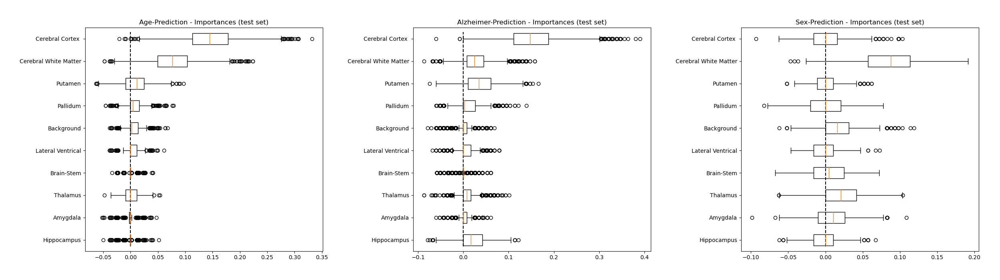

# Grouped Permutation Importance

Understanding the fundamentals of a decision-making process is, for most purposes, an essential
step in the field of machine learning. In this context, the analysis of predefined groups of 
features can provide important indications for comprehending and improving the prediction.
This repository extend the univariate permutation
importance to a grouped version for evaluating the
influence of whole feature subsets in a machine
learning model. This is done by a slight 
modification of the [permutation importance of scikit-learn](https://scikit-learn.org/stable/modules/permutation_importance.html). 

Install via pip

    pip install git+https://github.com/lucasplagwitz/grouped_permutation_importance

```python
from grouped_permutation_importance import grouped_permutation_importance

data = load_breast_cancer()
feature_names = data["feature_names"].tolist()
X, y = data["data"], data["target"]

idxs = []
columns = ["mean", "error", "worst"]
for key in columns:
    idxs.append([x for (x, y) in enumerate(feature_names) if key in y])

cv=StratifiedShuffleSplit(n_splits=10, test_size=0.2)
pipe = Pipeline([("MinMax", MinMaxScaler()),  ("SVC", SVC())])


r = grouped_permutation_importance(pipe, X, y, idxs=idxs, n_repeats=50, random_state=0, 
                                   scoring="balanced_accuracy", n_jobs=5, cv=cv, 
                                   perm_set="test")
```

<p align="center">

</p>

## Simulation

In the file "examples/make_class.py" a small simulation is shown to verify correctness. Based on [scikit-learns make_classification method](https://scikit-learn.org/stable/modules/generated/sklearn.datasets.make_classification.html), different informative subsets are analyzed.

<p align="center">

</p>

## Model interpretation

The file "examples/brain_atlas.py" demonstrates a neuroimaging example for rating brain regions depending on the target variable (age, CDR, biological sex). 

<p align="center">

</p>
