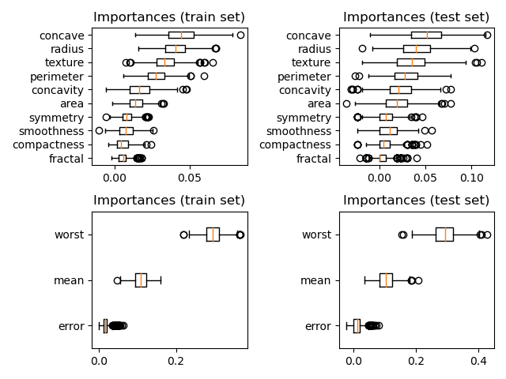
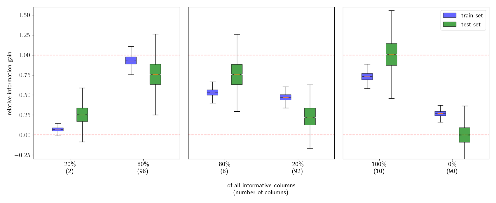

# Grouped Permutation Importance

The interpretability of machine learning models is a common task. 
In many domains datasets consist of different feature sources.  
This repository allows a simple analysis to calculate the influence 
of a feature group on the overall result. This is done by a slight 
modification of the permutation importance of scikit-learn. 

```python
data = load_breast_cancer()
feature_names = data["feature_names"].tolist()
X, y = data["data"], data["target"]

idxs = []
columns = ["mean", "error", "worst"]
for key in columns:
    idxs.append([x for (x, y) in enumerate(feature_names) if key in y])

cv=StratifiedShuffleSplit(n_splits=10, test_size=0.2)
pipe = Pipeline([("MinMax", MinMaxScaler()),  ("SVC", SVC())])


r = grouped_permutation_importance(pipe, X, y, idxs=idxs, n_repeats=50, random_state=0, 
                                   scoring="balanced_accuracy", n_jobs=5, cv=cv, 
                                   perm_set="train")
```

<p align="center">

</p>

## Simulation

File "examples/make_class.py" shows a small example using simulated feature-groups. This demonstrates the expressiveness of the method whereas a simple aggregation of single feature weights is refuted.

<p align="center">

</p>